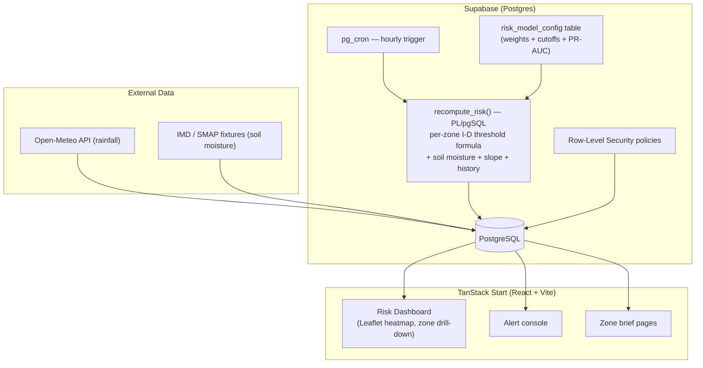

# Himalaya Sentinel

**SIH26001 — AI-Based Early Warning and Landslide Risk Monitoring System (NER)**

[](src/lib/risk.test.ts)

A landslide early-warning system for the North Eastern Region of India, built on **TanStack Start + Supabase**. Every risk alert includes a plain-language explanation of exactly which factor drove it — so district disaster management authorities can act with confidence, not just receive a number.

---

## Why this exists

GSI's LANDSLIP early-warning system is a real, working government system — but NER is listed as a *planned future expansion state*, not yet an active pilot. Published peer-reviewed research on NE-Himalaya-specific rainfall thresholds already exists. This project closes the regional coverage gap now, using those published equations, and adds a citizen-reporting layer that GSI's system does not have.

---

## Actual architecture



**Stack — everything that actually exists in this repo:**

| Layer | Technology |
|-------|-----------|
| Frontend | React 19 + TanStack Start + TanStack Router + TanStack Query |
| Mapping | Leaflet + react-leaflet |
| Styling | Tailwind CSS v4 + Radix UI |
| Backend | Supabase (Postgres + Auth + Row-Level Security) |
| Risk engine | PL/pgSQL function `recompute_risk()` |
| Scheduling | `pg_cron` (hourly recompute) |
| Model config | `risk_model_config` table (weights, cutoffs, PR-AUC) |
| Build tool | Vite 8 |
| Tests | Vitest |

> **Not in this repo**: FastAPI, Python services, Celery, Redis, Docker Compose.
> The risk engine runs entirely inside Postgres.

---

## Risk engine design

The score for each zone is a weighted sum of five factors, read from the active row of `risk_model_config`:

```
score = w_intensity  × clamp(72hr_rainfall / zone_I-D_threshold, 0, 1)
      + w_antecedent × clamp(30day_rainfall / zone_E_threshold,   0, 1)
      + w_soil       × soil_moisture_pct / 100
      + w_slope      × clamp(mean_slope_deg / 45°,                0, 1)
      + w_history    × clamp(historical_events / 4,               0, 1)
```

**Current baseline weights** (v0.1-hand-tuned, stored in `risk_model_config`):

| Factor | Weight | Source |
|--------|--------|--------|
| 72-hr rainfall intensity | 0.35 | Primary trigger signal |
| 30-day antecedent rainfall | 0.20 | Pre-wetting precondition |
| Soil moisture | 0.20 | Hillslope saturation state |
| Terrain slope | 0.15 | Static susceptibility |
| Historical landslide density | 0.10 | Proxy for lithology |

**Threshold equations** (published, not invented):

- **NE-Himalaya moisture threshold**: `E(mm) = -11.10 + 0.62 × D(hr)` — Sengupta et al. (2010), valid for 24 < D < 1440 hr
- **Sikkim I-D threshold**: `I = 43.26 × D^-0.78` — Das et al. (2018) NHESS 18:2759-2775, applied **only** to the two Sikkim zones (East Sikkim, Mangan); other zones use the NE-Himalaya regional baseline (I ≈ 36.0 × D^-0.72)

**Explanation strings** are generated dynamically: factors are ranked by their weighted contribution, so the explanation always names the actual dominant driver first. This is a linear-model feature attribution — no SHAP library needed for a weighted-sum formula.

### Retraining

Weights are stored in `risk_model_config`, not hardcoded. To recalibrate:
1. Run `ml-notebooks/01_risk_calibration.ipynb` with real landslide inventory data.
2. INSERT the new weights + PR-AUC into `risk_model_config`.
3. Flip `is_active = true`. Run `SELECT recompute_risk();`. Done — no redeploy.

See [`docs/MODEL_EVALUATION.md`](docs/MODEL_EVALUATION.md) for the evaluation methodology.

---

## Data sources and honesty

| Data | Current state | Real source |
|------|--------------|-------------|
| Rainfall | Open-Meteo API + IMD fixtures | Live via Supabase edge function (planned) |
| Soil moisture | Synthetic fixture (cosine function) | NASA SMAP Level-3 |
| Historical landslides | **Synthetic fixture — NOT from GSI Bhukosh** | GSI Bhukosh / Mathew et al. 2014 catalogue |
| Slope values | Published district studies + estimates | See `slope_source` column per zone |
| I-D thresholds | Calibrated for Sikkim; regional average for others | See `threshold_source` column per zone |

The UI displays an amber "⚠ Synthetic data" badge wherever synthetic landslide records appear. See [`docs/DATA_SOURCES.md`](docs/DATA_SOURCES.md) for exactly where to obtain real data and how to load it.

---

## Local development

You need Node.js ≥ 20 and the [Supabase CLI](https://supabase.com/docs/guides/cli).

```sh
git clone <this-repository-url>
cd landalert-nexus
npm install

# Start local Supabase (requires Docker)
supabase start
supabase db reset     # applies all migrations + seed data

# Run the frontend
npm run dev
```

### Run tests

```sh
npm run test          # Vitest unit tests for risk.ts threshold formulas
```

SQL regression test (requires a running local Supabase instance):
```sh
psql $DATABASE_URL -f supabase/smoke_test.sql
```

---

## Repository layout

```
landalert-nexus/
├── src/
│   ├── lib/
│   │   ├── risk.ts                  # Threshold formulas + UI helpers
│   │   └── risk.test.ts             # Vitest unit tests
│   ├── routes/
│   │   ├── index.tsx                # Dashboard
│   │   ├── zones.$id.tsx            # Zone detail / drill-down
│   │   └── alerts.tsx               # Alert history
│   └── components/                  # Leaflet map, risk badges, stat cards
├── supabase/
│   ├── migrations/
│   │   ├── 20260831092339_*.sql     # Initial schema + seed
│   │   ├── 20260904130500_gap1_*    # Region-specific thresholds (Gap 1)
│   │   ├── 20260904131000_gap2_*    # Soil moisture + dynamic explanation (Gaps 2+6)
│   │   ├── 20260904131500_gap3_*    # Synthetic data labeling (Gap 3)
│   │   ├── 20260904132000_gap4_*    # Slope source column (Gap 4)
│   │   └── 20260904132500_gap5_*    # risk_model_config table (Gap 5)
│   └── smoke_test.sql               # SQL regression guard
├── docs/
│   ├── DATA_SOURCES.md              # Where every data value comes from
│   └── MODEL_EVALUATION.md          # PR-AUC methodology + results table
└── ml-notebooks/
    └── 01_risk_calibration.ipynb    # Offline calibration notebook (Python)
```

---

## Judge Q&A

**"How is this different from GSI's LANDSLIP?"**  
LANDSLIP is a real system — we're not trying to out-build it. NER is listed as a planned future expansion, not yet covered. We apply NE-Himalaya-specific thresholds that already exist in peer-reviewed literature to close that gap now, and add citizen-reporting that GSI's system doesn't have.

**"Why a formula instead of deep learning?"**  
The formula IS a trained model: logistic regression coefficients map directly to the weights in `recompute_risk()`. Every alert includes a ranked attribution of which factor drove it — something a district officer needs to decide whether to evacuate a village. A black-box model gives a number; this gives a reason.

**"What's your PR-AUC?"**  
The `risk_model_config` table has a `pr_auc` column. The current baseline (v0.1-hand-tuned) shows NULL because it was calibrated from published literature, not a training run. The evaluation notebook is ready; see `docs/MODEL_EVALUATION.md`.

---

## Built with [Lovable](https://lovable.dev)

Continue developing in the [Lovable editor](https://lovable.dev/projects/02d6690c-3c6e-453b-a8e9-8b352c8f126e). Every change committed here syncs back to Lovable.
