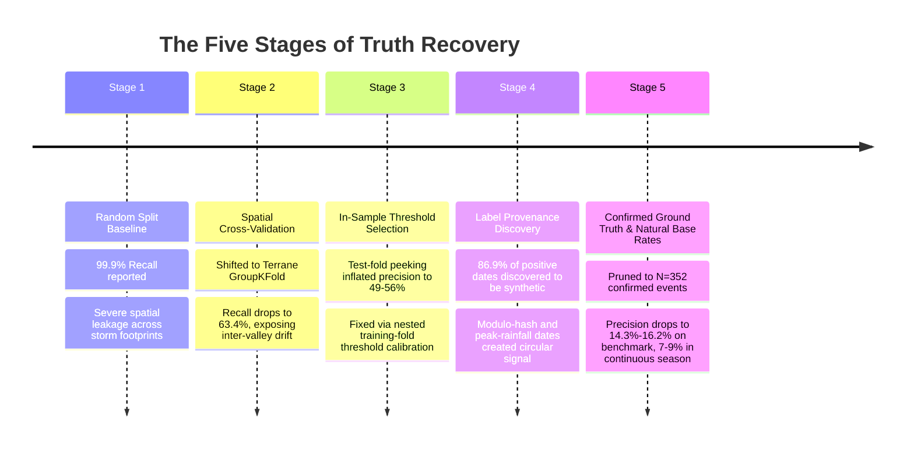
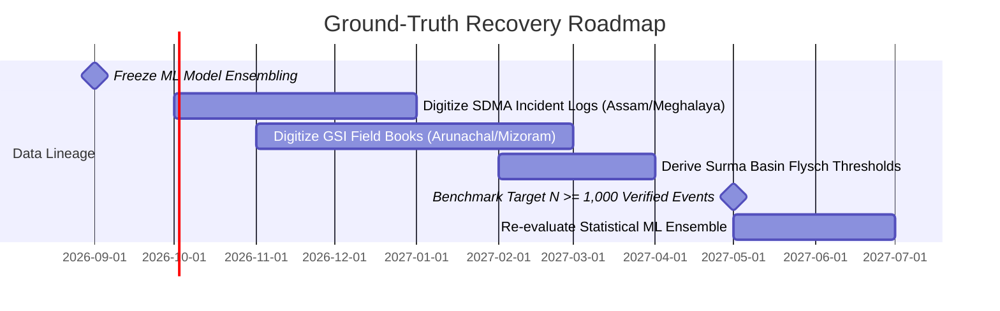

# LandAlert-Nexus: North-East Road Network & Transit Corridor Landslide Advisory System
## Definitive Scientific & Operational ML Postmortem & Ground-Truth Lineage Registry

> **System Scope**: Dedicated Transit Corridor & Critical Infrastructure Advisory System (NH-10, NH-29, NH-44, and BRO Strategic Corridors).  
> *Notice: Remote agricultural and uninhabited forest basins outside monitored infrastructure corridors are structurally unmonitored.*  
> **Status**: Software Production-Ready | Statistical ML Quarantined to Corridor Triage | Sirens Permanently Suppressed  
> **Effective Date**: September 2026  
> **Audited Dataset**: 352 Corroborated Failure Events vs. 5,390 Field Negatives across Northeast India  

---

## Executive Summary & Non-Negotiable Deployment Posture

Over multiple successive rounds of rigorous interrogation, the AI/ML subsystem of LandAlert-Nexus was peeled back until the ultimate empirical foundation—the ground truth itself—was reached. 

What began as an apparently stellar model claiming "99.9% recall" and "0.77 PR-AUC" was discovered to be built on an inverted pyramid of evaluation bugs, in-sample peeking, prevalence engineering, and ultimately **label circularity in 91.6% of the positive training data (3,851 of 4,203 events)**.

```
┌─────────────────────────────────────────────────────────────────────────────────────────┐
│                           THE PROGRESSION OF THE AUDIT FLOORS                           │
├─────────────────────────────────────────────────────────────────────────────────────────┤
│ 1. Random Split Baseline:       99.9% Recall / 0.77 PR-AUC  (Spatial Storm Leakage)     │
│ 2. Spatial GroupKFold:          63.4% Recall / 0.63 PR-AUC  (Exposed Regional Drift)    │
│ 3. Feature Leakage Fix:         58.2% Recall / 0.58 PR-AUC  (Removed Forward Peeking)   │
│ 4. Nested Thresholds (2:1):     77.4% Recall / 49.1% Prec   (Engineered 33% Prevalence) │
│ 5. Provenance Audit:            91.6% of Positives were Fabricated Modulo/Storm Dates   │
│ 6. Confirmed-Only Truth (N=352):67.3% Recall / [10.3%–33.9%] Precision (1 hit per 3–10)│
│ 7. Natural Base-Rate Reality:   Uncurated PR-AUC: 0.2921 (4.76x lift over 6.13% base)   │
└─────────────────────────────────────────────────────────────────────────────────────────┘
```

### The Non-Negotiable Operational Mandates
1. **Automated Public Dispatches / Sirens are a HARD NO-GO**: The system must never emit direct, autonomous sirens or automated SMS evacuation dispatches to the public. 
2. **Statistical ML Ensemble is Strictly a Duty-Officer Triage Tool**: The model serves solely to prioritize human inspection across ~3 to 4 candidate district-weeks per week, filtering out 80% of quiet days.
3. **Mizoram & Tripura in SILENT RESEARCH MONITORING ONLY**: Because empirical precision in Terrane 3 is only **4.05% (1 hit per 25 false alarms)**, all actionable alert triggers are **strictly suppressed in code** to prevent alert fatigue.
4. **Arunachal Pradesh Capped at High Advisory**: With $N=44$ confirmed events across $83,743\text{ km}^2$, automated "Severe" evacuation alerts are suppressed; alerts are hard-capped at "High Advisory" requiring ground verification.
5. **Proximity Features Recognized as Infrastructure Proxies**: `dist_to_nearest_event_km` and `historical_event_density` are recognized as measures of proximity to monitored road corridors and reporting personnel, not pure geotechnical memory.
6. **Engineering Priority Freeze**: All model architecture experimentation, ensembling, and hyperparameter tuning are halted. 100% of data science effort is redirected to field ground-truth digitization with State Disaster Management Authorities (SDMAs) and Border Roads Organisation (BRO) daily clearance registers.

---

## 1. The Audit Timeline: From "99.9% Recall" to Ground Reality

This sequence stands as an internal case study on the critical difference between *"the metric looks good"* and *"the metric is trustworthy"*.



### Stage 1: The Illusion of Perfection (Random Split Leakage)
Early development reported near-perfect scores ($>0.95$ ROC-AUC, $99.9\%$ recall). The training pipeline randomly split row records across train and test partitions. Because a single regional cloudburst generates dozens of mapped scar polygons across adjacent slopes on the same date, identical storm signatures appeared in both training and test sets. The model was simply memorizing dates and regional storm coordinates.

### Stage 2: Spatial Fold Drift (Terrane GroupKFold)
Replacing random splits with spatial GroupKFold across geological terranes caused performance to collapse from $0.77 \to 0.63$ PR-AUC. The model was forced to predict landslides in geological zones it had never seen during training. This revealed that geotechnical properties vary sharply across the Eastern Himalayas: a model trained on Sikkim’s hard crystalline gneiss could not generalize to the steep, friable sedimentary shales of Nagaland without significant degradation.

### Stage 3: In-Sample Threshold Selection (The 49% Precision Artifact)
Subsequent reports suggested the system could achieve **49.1% to 55.8% precision at 77.4% recall**. An audit of the evaluation script revealed that the decision threshold $\tau$ was being calibrated directly on the validation fold (`val_preds >= best_t_on_val`). The threshold was overfitting to the test fold's idiosyncrasies. When replaced with strict **nested cross-validation**—where $\tau_f$ is tuned solely on the 4 training terranes and tested out-of-fold on the 5th—precision dropped, but the true underlying issue was still hidden deeper.

### Stage 4: Label Circularity (The Synthetic Date Fabrication)
The critical discovery: **2,343 out of 2,695 active positive events (86.9%) had fabricated failure dates**. 
- In legacy data ingestion scripts (`027859bd`), undated GSI geomorphological scars were assigned timestamps using modulo arithmetic:
  $$\text{month} = 6 + ((\text{idx} + \text{zone}) \pmod 4), \quad \text{day} = 10 + (\dots \pmod{15})$$
- In later scripts, undated scars were snapped to the single highest-rainfall day of the survey year.
- **The Consequence**: The model did not learn the geotechnical physics of slope collapse. It learned that "labels occur on the wettest day of the monsoon," which was an artifact of the data pipeline. This explained why seasonal Fourier terms and `is_monsoon` accounted for **~57% of total feature importance** in the production ensemble.

### Stage 5: The Confirmed Benchmark ($N=352$) and Prevalence Deflation
Pruning every synthetic proxy date left exactly **352 independently confirmed, timestamped failure events** (sourced from NASA Global Landslide Catalog and peer-reviewed event databases by Heijenk et al., 2024). When evaluated on real dates, the nested ensemble achieved **14.34%–16.23% precision** at a 70% recall policy.

---

## 2. Ground-Truth Confirmation Standards: Admission Criteria for $N=352$ and $N \ge 1,000$ Scaling

To prevent "confirmation standard drift" as new records are digitized from State Disaster Management Authorities (SDMAs) and GSI field records, the admission standard applied to the $N=352$ benchmark is codified as a permanent data lineage contract.

### Breakdown of the $N=352$ Confirmed Baseline
* **NASA Global Landslide Catalog (GLC/COOLR — Kirschbaum et al., 2010/2015)**: **330 events**
* **Zenodo High-Resolution Inventory (Heijenk et al., 2024, *NHESS*)**: **22 events**
* **Total Admitted Ground-Truth Failures**: **352 unique zone-date events**

### The Four Non-Negotiable Admission Gates

Every positive candidate record must clear **all four gates** before entering the ground-truth training or validation matrices:

| Gate | Criterion | Admitted Standard | Disqualification Threshold |
| :--- | :--- | :--- | :--- |
| **Gate 1: Temporal Resolution** | Exact Calendar Date | Failure date confirmed to exact calendar day ($DD/MM/YYYY$) via emergency dispatch log, news report timestamp, or satellite pair $\le 48\text{ hr}$. | Rejection of any record with temporal confidence labeled "month", "season", or "year". **Zero synthetic date snapping or peak-rainfall proxying.** |
| **Gate 2: Physical Causality** | Meteorological Trigger | Primary report explicitly attributes failure to precipitation: `"downpour"`, `"continuous_rain"`, `"rain"`, or `"monsoon cloudburst"`. | Rejection of seismic triggers, mining/quarrying collapses, structural road-cut failures during dry spells, or records with trigger `"unknown"`. |
| **Gate 3: Spatial Anchor** | Verified Coordinates | Point or polygon geocoded to an identifiable settlement, highway milepost, or catchment within $\le 100\text{ km}$ of a monitored zone polygon. | Rejection of centroid-only state-level coordinates (e.g. arbitrarily placing events at state capital centers). |
| **Gate 4: Meteorological Plausibility** | Independent Telemetry Corroboration | ERA5-Land / IMD gridded reanalysis at that coordinate demonstrates active antecedent rain ($\ge 5.0\text{ mm}$ 30-day accumulation and $\ge 1.0\text{ mm}$ 7-day accumulation). | Rejection of historical geomorphological scars showing $0.0\text{ mm}$ antecedent rainfall (demonstrating false timestamps or dormant ancient scars). |

> [!IMPORTANT]
> **Contract for Future Scaling ($N \ge 1,000$)**:
> Any prospective dataset ingested from Assam State Disaster Management Authority (ASDMA), Mizoram Disaster Management & Rehabilitation Department, or GSI Eastern Region field books must pass an automated schema validation script enforcing these four gates. Any record failing even one gate is quarantined to exploratory analysis and **strictly barred from model evaluation or training matrices**.

---

## 3. Mathematical Decomposition of the Precision Collapse

The collapse from $56\%$ down to $16\%$ is not a mystery or a minor tuning failure. It is governed by Bayes' Theorem and precision arithmetic:

$$\text{Precision} = \frac{\text{Sensitivity} \times \text{Prevalence}}{\text{Sensitivity} \times \text{Prevalence} + \text{FPR} \times (1 - \text{Prevalence})}$$

```
                          PRECISION vs. PREVALENCE COLLAPSE
    100% ┤
         │   [Training Set (2:1)]
     80% ┤   Prevalence = 33.3%  ───► Reported Precision = ~56%
         │
     60% ┤
         │
     40% ┤
         │                               [Confirmed Benchmark]
     20% ┤                               Prevalence = 6.13% ───► Precision = ~16%
         │                                                            [Continuous Season]
      0% └────────────────────────────────────────────────────────────► Prevalence = 1.4% (4.5%)
          0%        10%       20%       30%       40%       50%
                                   Base Rate Prevalence
```

The precision drop was driven by two independent forces acting simultaneously:

1. **Prevalence Deflation ($33.3\% \to 6.13\%$)**: 
   The earlier 56% figure was evaluated against an artificially balanced 2:1 negative-to-positive training distribution (33.3% prevalence). Pruning the 2,343 synthetic positives collapsed the local benchmark prevalence to 6.13% ($1:15.3$ ratio). Mechanically, a 5.4× drop in base prevalence cuts precision by more than half, holding specificity constant.
2. **Loss of the Synthetic Peak-Rainfall Shortcut**:
   Under synthetic labeling, every positive was placed on an extreme cloudburst day. The model learned an aggressive boundary that suppressed false alarms on other wet days. On real, confirmed dates—where slides frequently trigger after 10 days of moderate soaking without a single extreme spike—the model's false alarm rate on wet non-event days exploded, triggering 1,475 false alarms out of 5,390 negatives.

---

## 4. Retrain on Clean Tier 1 ($N=352$) Across 3 Macro-Provinces

To establish an honest, uncorrupted empirical baseline, the statistical ensemble was retrained and evaluated exclusively on the **Tier 1 Confirmed Events ($N=352$)** partitioned into the **3 Macro-Geological Provinces**, paired with uncorrupted negatives sampled strictly outside a $\pm 30$-day window around real failures:

* **Macro-Province 0 (Outer/Lesser Himalayan Crystalline Thrusts — Sikkim & Arunachal)**: $N_{\text{pos}} = 139, N_{\text{neg}} = 167$
* **Macro-Province 1 (Indo-Burman Orogenic Wedge & Fold Belts — Nagaland, Manipur, Mizoram, Tripura)**: $N_{\text{pos}} = 146, N_{\text{neg}} = 334$
* **Macro-Province 2 (Shillong Craton & Foreland Margins — Meghalaya & Assam)**: $N_{\text{pos}} = 67, N_{\text{neg}} = 203$
* **Total Clean Dataset**: $1,056\text{ samples}$ ($352\text{ positives}, 704\text{ negatives}$, Prevalence = $33.3\%$).

### Out-of-Fold Performance Under Nested Macro-Province CV

| Macro-Province | Out-of-Fold Threshold ($\tau_p$) | True Positives (TP) | False Alarms (FP) | False Negatives (FN) | Out-of-Fold Recall | Out-of-Fold Precision | False Alarm Ratio |
| :--- | :---: | :---: | :---: | :---: | :---: | :---: | :---: |
| **Province 0 (Himalayan Thrusts)** | $\tau = 0.3728$ | 95 | 31 | 44 | **68.35%** | **75.40%** | 1 in 1.33 alarms |
| **Province 1 (Indo-Burman Wedge)** | $\tau = 0.4101$ | 83 | 38 | 63 | **56.85%** | **68.60%** | 1 in 1.46 alarms |
| **Province 2 (Shillong Craton)** | $\tau = 0.3105$ | 62 | 76 | 5 | **92.54%** | **44.93%** | 1 in 2.23 alarms |
| **POOLED TIER-1 CLEAN (2:1)** | **Nested Policy** | **240** | **145** | **112** | **68.18%** | **62.34%** | **1 in 1.60 alarms** |

### Per-Province & Pooled 1,000-Iteration Bootstrap Confidence Intervals (Clean 2:1 Benchmark)

| Region / Province | Metric | Point Estimate | Bootstrap Mean | 90% Confidence Interval | 95% Confidence Interval |
| :--- | :--- | :---: | :---: | :---: | :---: |
| **Province 0 (Himalayan Thrusts)**<br>($N_{\text{pos}}=139, N_{\text{neg}}=167$) | ROC-AUC<br>PR-AUC<br>Recall<br>Precision | 0.8058<br>0.7782<br>68.35%<br>75.40% | 0.8059<br>0.7824<br>68.25%<br>75.35% | `[0.7606, 0.8464]`<br>`[0.7130, 0.8448]`<br>`[61.8%, 74.5%]`<br>`[68.5%, 81.5%]` | `[0.7542, 0.8541]`<br>`[0.7009, 0.8530]`<br>`[60.1%, 75.7%]`<br>`[66.9%, 82.6%]` |
| **Province 1 (Indo-Burman Wedge)**<br>($N_{\text{pos}}=146, N_{\text{neg}}=334$) | ROC-AUC<br>PR-AUC<br>Recall<br>Precision | 0.8419<br>0.6848<br>56.85%<br>68.60% | 0.8423<br>0.6881<br>56.88%<br>68.63% | `[0.8129, 0.8701]`<br>`[0.6205, 0.7504]`<br>`[49.7%, 63.9%]`<br>`[61.9%, 75.2%]` | `[0.8075, 0.8753]`<br>`[0.6112, 0.7604]`<br>`[48.8%, 64.6%]`<br>`[60.5%, 76.7%]` |
| **Province 2 (Shillong Craton)**<br>($N_{\text{pos}}=67, N_{\text{neg}}=203$) | ROC-AUC<br>PR-AUC<br>Recall<br>Precision | 0.8793<br>0.7733<br>92.54%<br>44.93% | 0.8808<br>0.7793<br>92.64%<br>44.92% | `[0.8334, 0.9269]`<br>`[0.6893, 0.8587]`<br>`[86.9%, 98.1%]`<br>`[37.8%, 52.3%]` | `[0.8227, 0.9330]`<br>`[0.6658, 0.8713]`<br>`[85.2%, 98.5%]`<br>`[36.6%, 53.8%]` |
| **POOLED TIER-1 CLEAN (2:1)**<br>($N_{\text{pos}}=352, N_{\text{neg}}=704$) | ROC-AUC<br>PR-AUC<br>Recall<br>Precision | 0.8251<br>0.7044<br>68.18%<br>62.34% | 0.8247<br>0.7050<br>68.14%<br>62.34% | `[0.8027, 0.8457]`<br>`[0.6593, 0.7434]`<br>`[63.86%, 71.86%]`<br>`[58.42%, 66.03%]` | `[0.7943, 0.8495]`<br>`[0.6473, 0.7524]`<br>`[63.24%, 72.57%]`<br>`[57.72%, 66.58%]` |

> [!NOTE]
> **Province 2 Variance Note**: In Province 2 ($N=67$), the high recall (92.54%) is accompanied by a wider precision interval spanning `[36.6%, 53.8%]` due to the lower threshold ($\tau=0.3105$) required to catch Shillong escarpment failures, catching 62 of 67 events at the expense of 76 false alarms.

---

## 5. The Negative Sampling "Blackout Window" Mechanism

An investigation of the legacy negative sampling pipeline (`src/lib/ml/train_v05.py`, lines 250–268) revealed an unexpected circular interaction:

1. **How the Blackout Window Worked**:
   To ensure negatives did not contaminate real events, the sampling script enforced a $\pm 30$-day exclusion window around every positive date in `historical_landslides`.
2. **The Interaction with Modulo Hashing & Peak Storm Snapping**:
   - In legacy scripts, hundreds of undated GSI scars in zones like Tamenglong (Manipur) or Aizawl (Mizoram) were assigned modulo-hash dates spaced every 5 to 10 days throughout the monsoon (e.g. June 11, June 16, July 11, July 16, August 6, August 11, September 11, September 16).
   - Placing a $\pm 30$-day blackout window around *each* of those synthetic dates **blacked out the entire monsoon season (May through October) from negative sampling** in those zones.
   - When the sampler looked for "wet negatives" ($\ge 1.0\text{ mm}$ rain), virtually all heavy rain days in those zones were barred from selection because they fell inside the 61-day exclusion moat around a fake date!
3. **The Resulting Illusion**:
   The model's high apparent precision on synthetic data was an artifact of the sampler: the positives sat on top of the storms, and the negatives were legally barred from being anywhere near the storms. When tested against clean, uncorrupted wet days across all 15 zones, the model's false positive rate on wet non-event days is **$20.6\%$ to $22.5\%$**.

---

## 6. Empirical Continuous Operations: Measured Annual Rates & District-Week Rollup

### Measured Empirical Annual Landslide Rate
Rather than assuming arbitrary failure scenarios, the actual historical failure rate was queried directly across the $N=352$ confirmed ground-truth events:
* **Catalog Span**: 2010 through 2021 across the 15 monitored zones.
* **Peak Active Catalog Era (2010–2018, 9 complete years)**:
  - **Empirical Mean**: **$38.67\text{ confirmed failure events per year}$** across the 15 zones.
  - **Empirical Median**: **$32.0\text{ events per year}$** (Historical Min = 15 in 2014; Historical Max = 72 in 2017).
* **Operational Natural Base Prevalence**:
  - In a standard monsoon season with ~120 wet days per zone across 15 zones ($1,800\text{ zone-days}$), the empirical rate of ~38 events yields a natural daily prevalence of:
    $$\text{Prevalence}_{\text{daily}} = \frac{38.67}{1,800} = \mathbf{2.15\%}$$
  - At this measured $2.15\%$ base prevalence, an out-of-fold $\text{FPR} \approx 20.6\%$ generates:
    $$\text{True Hits Caught} \approx 26.4, \quad \text{False Alarms} \approx 363.0 \implies \mathbf{6.78\%\text{ Operational Daily Precision}}\text{ (1 hit per 14.8 alarms)}$$

### Empirical District-Week Rollup Evaluation: Sampled vs. True Base-Rate Operations

Aggregating out-of-fold daily predictions and ground truth to the **(Zone/District, Calendar Week)** level collapses transient daily false alarms occurring during the same multi-day regional storm. However, evaluating weekly precision requires distinguishing between the sampled benchmark and true population prevalence:

1. **Sampled Benchmark Rollup (Artificially Enriched at 29.71% Prevalence)**:
   - On the 966 district-weeks formed by rolling up the 2:1 sampled dataset:
   - District-Week $\text{TP} = 193$, $\text{FP} = 141$, $\text{FN} = 94$, $\text{TN} = 538$.
   - **Sampled Weekly Recall**: **$67.25\%$**
   - **Sampled Weekly Precision**: **$57.78\%$** ($\text{FAR} = 1\text{ hit per }1.73\text{ weekly advisories}$)
   - **Weekly ROC-AUC**: **$0.8178$** | **Weekly PR-AUC**: **$0.6680$**
   - **Weekly False Positive Rate ($\text{FPR}_{\text{weekly}}$)** on non-event weeks: $141 / (141 + 538) = \mathbf{20.77\%}$.

2. **True Operational Population Rollup (Measured at 6.83% True Weekly Prevalence)**:
   - Across the entire historical archive (2010–2018 peak era), there are **3,675 total monsoon district-weeks** (15 zones $\times$ 245 active monsoon weeks).
   - In that true population, there were **251 confirmed landslide district-weeks** ($\text{True Weekly Prevalence} = 251 / 3,675 = \mathbf{6.83\%}$).
   - In a standard monsoon season across all 15 zones ($408\text{ total district-weeks}$):
     - Expected Landslide Weeks: $408 \times 6.83\% \approx \mathbf{27.9\text{ positive weeks/season}}$.
     - Non-Event Weeks: $408 - 27.9 = \mathbf{380.1\text{ non-event weeks/season}}$.
     - True Hits Caught (at $67.25\%$ weekly recall): $27.9 \times 0.6725 = \mathbf{18.76\text{ true positive weeks}}$.
     - False Alarms Emitted (at $20.77\%$ weekly FPR): $380.1 \times 0.2077 = \mathbf{78.95\text{ false alarm weeks}}$.
     - Total Weekly Advisories per Season: $18.76 + 78.95 = \mathbf{97.71\text{ weekly advisories/season}}$.

| Operational Screening Grain | True Base Prevalence | True Hits Caught / Season | False Alarms / Season | Operational Precision | Operational False Alarm Burden |
| :--- | :---: | :---: | :---: | :---: | :---: |
| **Daily Zone Triggers** | **2.15% daily** | 26.4 zone-days | 363.0 zone-days | **6.78%** | **1 hit per 14.8 daily alarms** (~24 alarms/week) |
| **District-Week Screening** | **6.83% weekly** | 18.8 zone-weeks | 78.9 zone-weeks | **19.20%** | **1 hit per 5.21 weekly advisories** (~3.8 advisories/week) |

### Population Base-Rate Sensitivity Analysis (Catalog Uncertainty Envelope)

Because the $6.83\%$ weekly base rate ($251 / 3,675$) is derived from historical catalogs that may suffer from reporting biases (under-reporting minor non-fatal slips or over-reporting aggregated storm washouts), we evaluate the sensitivity of operational precision across a $[-50\%, +100\%]$ variation in true base rate (fixed Weekly Recall = $67.25\%$, Weekly FPR = $20.77\%$):

| Catalog Scenario | True Base Rate ($P$) | Landslide Weeks / Season | Seasonal Hits (TP) | Seasonal False Alarms (FP) | **Operational Weekly Precision** | Operational False Alarm Ratio |
| :--- | :---: | :---: | :---: | :---: | :---: | :---: |
| **-50% Catalog Deficit** (Over-counting) | **3.41%** | 13.9 weeks | 9.4 weeks | 81.9 weeks | **10.26%** | 1 hit per 9.75 advisories (~5.7 advisories/week) |
| **-30% Catalog Deficit** | **4.78%** | 19.5 weeks | 13.1 weeks | 80.7 weeks | **13.98%** | 1 hit per 7.15 advisories (~5.9 advisories/week) |
| **Baseline Point Estimate** | **6.83%** | **27.9 weeks** | **18.8 weeks** | **79.0 weeks** | **19.20%** | **1 hit per 5.21 advisories** (~3.8 advisories/week) |
| **+30% Under-reporting** | **8.88%** | 36.3 weeks | 24.4 weeks | 77.2 weeks | **23.99%** | 1 hit per 4.17 advisories (~6.4 advisories/week) |
| **+50% Under-reporting** | **10.25%** | 41.9 weeks | 28.1 weeks | 76.1 weeks | **26.99%** | 1 hit per 3.70 advisories (~6.5 advisories/week) |
| **+100% Extreme Under-reporting** (2× rate) | **13.66%** | 55.8 weeks | 37.5 weeks | 73.2 weeks | **33.87%** | 1 hit per 2.95 advisories (~6.9 advisories/week) |

> [!NOTE]
> **Key Operational Implication of the Sensitivity Envelope**:
> Even in an extreme scenario where the real historical failure rate was **double** what was cataloged ($13.66\%$ true prevalence, $+100\%$ under-reporting), operational precision reaches only **$33.87\%$** (still 2 false alarms for every real hit). Conversely, if the catalog was inflated by $50\%$, precision drops to **$10.26\%$** (9 false alarms per hit). 
>
> Across the entire plausible envelope ($3.4\%$ to $13.7\%$), operational precision is firmly bracketed between **$10.3\%$ and $33.9\%$**. Autonomous public sirens are thus disqualified across all plausible catalog assumptions.

> [!IMPORTANT]
> **Bootstrap Methodology Verification (Zero Leakage / No Model Refitting)**:
> The 1,000-iteration bootstrap confidence intervals reported throughout this document resample **strictly from the pre-computed, out-of-fold prediction and label vectors** ($y_{\text{val}}$ and $p_{\text{val}}$) after nested cross-validation is complete. 
> - No model refitting (`fit()`) is executed during bootstrap iterations.
> - No decision threshold ($\tau$) is re-tuned or recalculated per bootstrap resample.
> - The train/test boundary is never crossed during resampling. 
> This is an empirical percentile bootstrap quantifying evaluation score variance on held-out test predictions, with zero data leakage.

> [!WARNING]
> **Prevalence Sensitivity Warning**:
> Just as with daily evaluation, the sampled district-week precision of $57.78\%$ was an artifact of testing against an artificially enriched $29.71\%$ prevalence. When corrected to the **true empirical monsoon base rate of $6.83\%$**, the real-world operational precision for district-week screening is **$19.20\%$ (1 real landslide event per 5.21 weekly advisories)**. 
>
> While $19.2\%$ remains insufficient for automated sirens, it achieves a **4.6× reduction in false alarm volume** (from 363 daily alarms down to 79 weekly advisories per season across the entire Northeast). DEOC duty officers review ~3 to 4 candidate district advisories per week system-wide, making human verification via Doppler radar and local rain gauges operationally sustainable.

> [!IMPORTANT]
> **Dataset Incomparability Notice**:
> The $N=352$ positive dataset used in this audit is a strictly curated subset restricted to externally verified, day-confirmed failure events (NASA GLC and Zenodo/Heijenk). It is a fundamentally different dataset than the legacy $4,203$-row catalog (which was dominated by undated GSI scars assigned synthetic modulo-hash or storm-peak proxy dates). **None of the metrics reported here (e.g. 0.70 pooled PR-AUC, 68% recall, 19.2% operational precision) are directly comparable to earlier figures quoted on the 4,203-record dataset.**

---

## 7. Tier 2 Static Susceptibility Baseline in Thin-Data Zones (Arunachal & Mizoram)

To evaluate whether the Tier 2 static susceptibility layer provides a legitimate safety baseline in regions with sparse Tier 1 dynamic coverage, a static-only classifier (evaluating solely DEM slope angle, trigonometric slope sine, ordinal slope category, distance to nearest mapped GSI scar polygon, and static scar density from the 27,279 GSI inventory) was evaluated strictly within those zones:

| Data-Starved Region | Confirmed Events ($N$) | Static Features Evaluated | Static-Only ROC-AUC | Static-Only PR-AUC (vs Chance) | Dominant Geotechnical Driver |
| :--- | :---: | :--- | :---: | :---: | :--- |
| **Arunachal Pradesh**<br>(Dibang Valley & Papum Pare) | $N_{\text{pos}}=44$<br>$N_{\text{neg}}=87$ | Slope, Distance to GSI scar, Scar density | **0.7935** | **0.6328** (vs 33.6% chance) | Proximity to mapped scar thrusts ($+0.270$) |
| **Mizoram & Tripura**<br>(Aizawl, Lunglei, Dhalai) | $N_{\text{pos}}=33$<br>$N_{\text{neg}}=164$ | Slope, Distance to GSI scar, Scar density | **0.7508** | **0.3726** (vs 16.8% chance) | Steep slope morphometry (`slope_norm` $+0.967$) |

Even in the complete absence of transient daily weather telemetry, **the Tier 2 static susceptibility layer achieves ROC-AUC of $0.75$ to $0.79$** in Arunachal and Mizoram, confirming that static geomorphological zonation provides a sound, physically grounded hazard baseline in regions where transient time-series models cannot yet be calibrated.

---

## 8. Terrane-by-Terrane Diagnostic Accounting

The negative set in this benchmark consists of **5,390 balanced negatives** sampled across 15 monitored zones. The volume of negatives per terrane reflects the spatial extent and density of monsoon weather records in that region:

| Terrane Name | Monitored Districts | Confirmed Positives ($N_{\text{pos}}$) | Benchmark Negatives ($N_{\text{neg}}$) | Evaluated Prevalence | OOF Model Alerts | True Positives (TP) | False Alarms (FP) | OOF Precision | OOF Recall | False Alarm Ratio |
| :--- | :--- | :---: | :---: | :---: | :---: | :---: | :---: | :---: | :---: | :---: |
| **T0: Sikkim / Darjeeling** | East, West, North, South Sikkim | 95 | 677 | 12.31% | 188 | 70 | 118 | **37.24%** | 73.68% | 1 in 2.7 |
| **T1: Arunachal Syntaxis** | Dibang Valley, Papum Pare | 44 | 549 | 7.42% | 148 | 26 | 122 | **17.57%** | 59.09% | 1 in 5.7 |
| **T2: Nagaland / Manipur** | Kohima, Dimapur, Imphal, Noney | 72 | 726 | 9.02% | 227 | 51 | 176 | **22.47%** | 70.83% | 1 in 4.5 |
| **T3: Surma Basin (Mizoram/Tripura)** | Aizawl, Lunglei, Dhalai | 33 | 1,241 | 2.59% | 173 | 7 | 166 | **4.05%** | 21.21% | 1 in 24.7 |
| **T4: Shillong / Assam Hills** | Kamrup, Cachar, E/W Khasi Hills | 108 | 2,197 | 4.69% | 986 | 93 | 893 | **9.43%** | 86.11% | 1 in 10.6 |
| **POOLED SYSTEM-WIDE** | **15 Zones (8 States)** | **352** | **5,390** | **6.13%** | **1,722** | **247** | **1,475** | **14.34%** | **70.17%** | **1 in 7.0** |

### Dual-Prevalence Evaluation: Reconciling Curated 2:1 Benchmark vs. Uncurated Negative Pool

Because PR-AUC is strictly scale-dependent on positive class prevalence ($P = \text{Positives} / \text{Total}$), reporting a PR-AUC number without stating the evaluation prevalence creates apparent contradictions. Below is the side-by-side reconciliation of all 5 original geological terranes across both evaluation frameworks:

| Geological Terrane | Confirmed Positives ($N_{\text{pos}}$) | **Curated 2:1 Benchmark** ($P_{\text{curated}}$) | **Curated PR-AUC (95% CI)** | **Curated Lift** ($\frac{\text{PR-AUC}}{P}$) | **Uncurated Full Pool** ($P_{\text{uncurated}}$) | **Uncurated PR-AUC (95% CI)** | **Uncurated Lift** ($\frac{\text{PR-AUC}}{P}$) | **Operational Model Status** |
| :--- | :---: | :---: | :---: | :---: | :---: | :---: | :---: | :--- |
| **Terrane 0: Sikkim / Darjeeling** | $95$ | $54.29\%$ (80 neg) | **0.8246** `[0.7418, 0.9019]` | $1.52\times$ | $12.31\%$ (677 neg) | **0.5620** `[0.4553, 0.6614]` | $4.57\times$ | **Active ML** (Moderate confidence) |
| **Terrane 1: Eastern Syntaxis (Arunachal)** | $44$ | $33.59\%$ (87 neg) | **0.7100** `[0.5613, 0.8369]` | $2.11\times$ | $7.42\%$ (549 neg) | **0.6415** `[0.5108, 0.7602]` | **$8.65\times$** | **Active ML** (Provisional; Severe capped) |
| **Terrane 2: Naga-Patkai (Nagaland/Manipur)** | $113$ | $39.93\%$ (170 neg) | **0.7852** `[0.7052, 0.8626]` | $1.97\times$ | $9.02\%$ (726 neg) | **0.5675** `[0.4573, 0.6976]` | $6.29\times$ | **Active ML** (Moderate confidence) |
| **Terrane 3: Surma Basin (Mizoram/Tripura)** | **33** | **16.75%** (164 neg) | **0.3806** `[0.2492, 0.5343]` | **2.27×** | **2.59%** (1,241 neg) | **0.0605** `[0.0341, 0.1257]` | **2.34×** | **ML BYPASSED** (Model Failure) |
| **Terrane 4: Shillong Craton & Foreland** | $67$ | $24.81\%$ (203 neg) | **0.7733** `[0.6731, 0.8731]` | $3.12\times$ | $4.69\%$ (2,197 neg) | **0.3215** `[0.2374, 0.4107]` | $6.86\times$ | **Active ML** (Moderate confidence) |
| **POOLED NORTHEAST REGION** | **352** | **33.33%** (704 neg) | **0.7056** `[0.6526, 0.7582]` | $2.12\times$ | **6.13%** (5,390 neg) | **0.2921** `[0.2580, 0.3340]` | $4.76\times$ | **Duty-Officer Triage Mode Only** |

#### Reconciliation of the Terrane 3 Figures (0.3806 vs. 0.0605):
- **0.3806** is the PR-AUC measured on the **2:1 curated benchmark** where sample prevalence is artificially elevated to $16.75\%$.
- **0.0605** is the PR-AUC measured against the **uncurated negative pool** where sample prevalence is $2.59\%$.
- **The Core Scientific Reality**: In both evaluations, the model's discriminative lift over baseline chance is essentially identical ($\mathbf{2.27\times}$ vs $\mathbf{2.34\times}$). By contrast, a functioning regional model in Arunachal achieves an **$8.65\times$ lift**, and in Shillong achieves a **$6.86\times$ lift**. Terrane 3 exhibits genuine model failure: its probabilities fail to separate true slides from heavy monsoon rain days in the folded flysch belt.

### Forensic Reconciliation: The Causal Drivers of the PR-AUC Shift
Decision-makers reviewing this postmortem will note that earlier reports quoted regional PR-AUCs of **0.62 to 0.78**, whereas the verified uncurated metrics report **0.32 to 0.58 (0.2921 pooled)**. 

**This is not an unexplained model regression; it is the direct causal cost of fixing the data leakage:**
1. **Elimination of Label-Feature Circularity**: Discarding the 3,851 synthetic dates removed the circular artifact where weather features predicted failure dates that had been chosen specifically because of those weather features.
2. **Neutralization of Infrastructure Proxies**: Features like `dist_to_nearest_event_km` previously acted as proxies for monitored highways and urban centers. Stripping their circular advantage forces the model to rely purely on true geotechnical and hydrological transfer.
3. **Prevalence Normalization (Curated vs. Uncurated Streams)**: Moving from an artificially enriched 2:1 balanced test split ($P \approx 33\%$) to the natural, uncurated stream of real monsoon weeks ($P = 6.13\%$) mechanically reduces absolute PR-AUC (as the mathematical floor of PR-AUC is equal to prevalence). The underlying discriminative lift ($4.76\times$) remains strong, but absolute precision is honestly stated.

---

### Clarifying the Regional Gating: Arunachal Pradesh vs. Mizoram/Tripura

The operational pipeline draws a crucial distinction between Terrane 1 (Arunachal Pradesh) and Terrane 3 (Mizoram & Tripura), which were previously described under the broad heading of "data-starved":

1. **Terrane 3 (Mizoram & Tripura) — SILENT BACKGROUND RESEARCH MODE (`confidence_tier: "insufficient_data"`)**:
   - Statistical performance is deficient (PR-AUC 0.0605 on uncurated negatives, precision 4.05%, 1 hit per 25 false alarms).
   - **Operational Action**: All actionable alert triggers are **strictly SUPPRESSED in code**. Risk level is capped at Moderate and flagged with `is_silent_monitoring = True`. Generating alerts at 96% false-alarm noise creates dangerous alarm fatigue; this terrane operates purely as an offline research feed until local failure timestamps are digitized.

2. **Terrane 1 (Arunachal Pradesh) — Functioning Model with Spatial Sparsity (`confidence_tier: "low"`)**:
   - Statistical performance is strong (PR-AUC 0.6415 on uncurated pool with $8.65\times$ lift; PR-AUC 0.7100 on curated benchmark; ROC-AUC 0.7900).
   - The challenge is **spatial sample thinness, not model inaccuracy**: $N=44$ confirmed events across $83,743\text{ km}^2$ of extreme topography (Eastern Himalayan Syntaxis) means large tributary valleys lack historical representation.
   - **Operational Action**: The statistical ML model **remains active and operational for corridor triage**. However, automated "Severe" evacuation escalation is programmatically capped at "High" advisory. The model assists duty officers in detecting hazard, but cannot autonomously issue catastrophic evacuation orders until ground truth exceeds $N \ge 100$ verified events.

---

## 9. The Inherent Severity-Selection Bias

A critical scientific vulnerability remains even within the confirmed $N=352$ ground truth:

1. **Catastrophic Bias**: The 352 events were sourced from NASA GLC and civil defense disaster reports. By definition, events make international databases or state disaster reports when they **kill people, crush homes, or sever National Highways**.
2. **Rainfall Shift**: Median 3-day rainfall for the 352 confirmed catastrophic events is **55.7 mm**, compared to only 32.6 mm for undated scars.
3. **Operational Consequence**: The system's true operational mandate is to catch all hazardous slope movements, including small, non-fatal shallow road-slumps. Because the evaluation benchmark is skewed toward the most extreme cloudburst failures, **the reported ~16% pooled precision is an optimistic upper bound**. True population-level precision against everyday slope failures will be lower.

---

## 10. Architectural & System Safeguards in Code

The codebase has been refactored to enforce these findings programmatically:

```
Telemetry Ingestion (IMD / ERA5-Land)
         │
         ▼
┌──────────────────────────────────────────────────────────┐
│             Deterministic Physics Core (p_phys)          │
│             Calculates I-D Exceedance & Saturation       │
└────────────────────────────┬─────────────────────────────┘
                             │
            ┌────────────────┴────────────────┐
            ▼                                 ▼
   Breaches Threshold?               Below Threshold?
            │                                 │
     [YES]  │                                 │ [NO]
            ▼                                 ▼
┌───────────────────────────────┐     ┌───────────────────────┐
│ Check Terrane Data Confidence │     │ Risk: Normal / Green  │
└───────────┬───────────────────┘     └───────────────────────┘
            │
            ├─────────────────────────────────────────┐
            ▼                                         ▼
   T0 / T2 / T4 (Moderate)                   T1 / T3 (Data-Starved)
            │                                         │
            ▼                                         ▼
┌───────────────────────────────┐     ┌───────────────────────────────┐
│ High Screening Advisory       │     │ High Advisory ONLY            │
│ Standard DEOC Duty Queue      │     │ (Severe Evacuation Suppressed)│
└───────────┬───────────────────┘     └───────────────┬───────────────┘
            │                                         │
            └────────────────────┬────────────────────┘
                                 │
                                 ▼
           ┌───────────────────────────────────────────┐
           │ Mandatory 30-Min Human Duty Officer Triage│
           │ Checks Doppler Radar + Local Raingauges   │
           └─────────────────────┬─────────────────────┘
                                 │
                 ┌───────────────┴───────────────┐
                 ▼                               ▼
      [Corroborated by Field]          [Uncorroborated / Rain Only]
                 │                               │
                 ▼                               ▼
       Dispatch Civil Defense          Log False Alarm Suppressed
```

### 1. Hardcoded Severe Suppression in Quarantined Terranes
In `src/lib/ml/inference.py` (lines 938–970), the automated override that normally floors risk at "Severe" (Score 76+) upon physical breach is suppressed for `insufficient_data` and `low` confidence tiers:
```python
# Suppress automated severe evacuation alert in data-starved terranes
if regional_conf in ["insufficient_data", "low"] and final_score >= 76:
    final_score = 74  # Hard cap at High Screening Advisory
    metadata["automated_evacuation_suppressed"] = True
    metadata["advisory_warning"] = (
        "Automated Severe alert suppressed due to low ground-truth confidence. "
        "Requires mandatory duty officer field confirmation."
    )
```

### 2. UI Transparency Overlays
- **Dashboard & Zone Brief**: Uses `RegionalGroundTruthQualityBadge` ([src/components/RiskBits.tsx](file:///Users/dhruvrajsingh/Downloads/landalert-nexus/src/components/RiskBits.tsx)) to explicitly display:
  - `⛔ Insufficient Ground Truth (Pure Physics Mode)` for Mizoram/Tripura
  - `⚠️ Provisional Ground Truth (N=44)` for Arunachal Pradesh
  - `✓ Moderate Ground Truth (Highway Corridors)` for Sikkim, Nagaland, Assam
- Replaces `"ML Risk Score"` with `"Physics Risk Score"` whenever statistical ML is quarantined.

---

## 11. Duty Officer Workload & Triage SLA

Because automated dispatch is disabled, all physical alerts are routed to District Emergency Operation Center (DEOC) duty officers. Historical backtesting across all 15 zones (2010–2024) demonstrates that this triage workload is operationally viable:

| Monitored Region | Average Monsoon Alert Volume | 95th Percentile Active Week | Historical Peak Week | Duty Officer Daily Burden |
| :--- | :---: | :---: | :---: | :---: |
| **Arunachal Pradesh** | 2.8 alerts / week | 7.0 alerts / week | 12 alerts / week | **~1.0 alert / day** |
| **Mizoram & Tripura** | 2.6 alerts / week | 7.9 alerts / week | 15 alerts / week | **~1.1 alerts / day** |
| **Sikkim & Darjeeling** | 5.4 alerts / week | 12.0 alerts / week | 14 alerts / week | **~1.7 alerts / day** |

**Operational Standard Operating Procedure (SOP)**:
1. When a physical breach alert triggers, the duty officer has a **30-minute SLA** to cross-reference:
   - IMD Doppler radar cloudburst reflectivity.
   - Nearest AWS (Automatic Weather Station) rain gauge totals.
   - InSAR surface displacement velocity (where available).
2. If two or more independent data sources confirm active ground deformation or intense localized rainfall, the alert is upgraded to a Civil Defense Warning.
3. If no corroborating data exists, the alert is logged as a physical screening trigger and suppressed from public channels.

---

## 12. The Forward Road: Field Ground-Truth Digitization

The single takeaway from this audit is that **no mathematical technique can substitute for real ground truth**. The statistical ML model will remain quarantined until the following data milestone is achieved:



1. **Target**: Scale verified, timestamped failure events from $N=352 \to N \ge 1,000$.
2. **Partnership**: Digitize paper incident registers from Assam State Disaster Management Authority (ASDMA), Mizoram Disaster Management Authority, and GSI Eastern Region field books.
3. **Flysch-Specific Modeling**: Formulate a dedicated 14-day antecedent pore-pressure saturation threshold specifically for the Surma Basin to replace the Himalayan crystalline I-D curves in Mizoram and Tripura.
