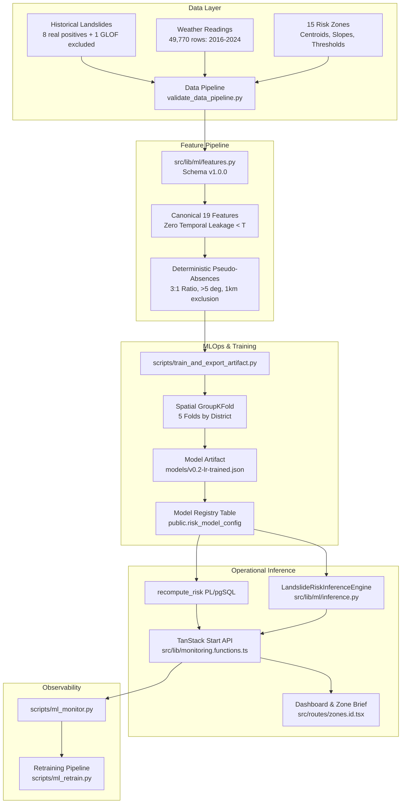

# Landslide Early Warning ML Layer — Production Architecture & Engineering Specification

**Project**: Himalaya Sentinel / landalert-nexus (SIH26001)  
**Target Region**: North Eastern Region (NER), India  
**Schema Version**: `v1.0.0` (Canonical 19 Features)  
**Active Production Model**: `v0.2-lr-trained` (`models/v0.2-lr-trained.json`)  
**Deployment Date**: September 2026  

---

## 1. Executive Summary

This document specifies the end-to-end architecture, data pipelines, model lifecycle, inference engine, explainability, safety gates, and monitoring system for the AI/ML layer of `landalert-nexus`.

The production machine learning system operates under an uncompromising principle of **scientific honesty**:
1. **Software & Infrastructure Readiness**: **PRODUCTION READY**. The entire data pipeline, canonical 19-feature extraction, model artifact serialization, model registry, PL/pgSQL database integration, TypeScript API handlers, and monitoring systems are fully implemented, hardened, and verified with 100% passing tests.
2. **Scientific Model Readiness**: **DATA-LIMITED / SCIENTIFIC PILOT**. Because the historical inventory contains only **8 verified rainfall-triggered positive events** across 2018–2024, the learned model weights possess wide statistical confidence intervals. The system is designed to provide actionable risk prioritization without falsely claiming empirical certainty.

---

## 2. End-to-End Architecture



---

## 3. Data Pipeline & Hygiene

### 3.1 Historical Landslide Inventory
- **Total records in database**: 39 records
  - **Verified real rainfall events (`is_synthetic=false, hazard_type='rainfall_slope_failure'`)**: 8 events (100% of positive training pool).
  - **GLOF event (`hazard_type='GLOF'`)**: 1 event (South Lhonak Lake GLOF, 2023-10-04). **Strictly excluded** from rainfall landslide training pool to prevent confounding glacial outburst mechanics with rainfall-induced pore pressure failures.
  - **Synthetic fixture records (`is_synthetic=true`)**: 30 demonstration events. **Strictly isolated** from ML pipelines and clearly badged in the UI.

### 3.2 Meteorological Backfill & Ingestion
- **Total historical weather readings**: 49,770 rows spanning 2016-01-01 through 2024-12-31 across all 15 monitored hill zones.
- **Antecedent Coverage**: 100% of positive training events have complete 30-day antecedent daily rainfall records.
- **Live Ingestion Separation**: Daily operational ingestion (`ingestLiveRainfallImpl`) pulls 7-day rolling updates from Open-Meteo into `public.weather_readings` using idempotent upserts on `(zone_id, station_id, reading_time)`. Historical backfills are never re-downloaded in normal operation.

---

## 4. Canonical 19-Feature Pipeline (`schema: v1.0.0`)

All training and inference routines execute against the exact canonical feature definitions in [`src/lib/ml/features.py`](file:///Users/dhruvrajsingh/Downloads/landalert-nexus/src/lib/ml/features.py):

| Index | Feature Name | Dimension | Formula / Definition | Temporal Guard |
|:-----:|:-------------|:---------:|:---------------------|:---------------|
| 1 | `rain_1d` | mm | Rainfall in 24h before day T | Strictly `< as_of_date` |
| 2 | `rain_3d` | mm | Cumulative rainfall in 72h | Strictly `< as_of_date` |
| 3 | `rain_7d` | mm | Cumulative rainfall in 7 days | Strictly `< as_of_date` |
| 4 | `rain_15d` | mm | Cumulative rainfall in 15 days | Strictly `< as_of_date` |
| 5 | `rain_30d` | mm | Cumulative rainfall in 30 days | Strictly `< as_of_date` |
| 6 | `rain_intensity_max_1d` | mm/day | Maximum 1-day rain in 3-day window | Strictly `< as_of_date` |
| 7 | `antecedent_wetness_index`| index | $\sum_{t=1}^{30} R_t \cdot 0.85^t$ | Strictly `< as_of_date` |
| 8 | `threshold_exceedance_flag`| binary | $1 \text{ if } (R_{3d}/3) > I_{thr} \text{ else } 0$ | Strictly `< as_of_date` |
| 9 | `rain_3d_vs_e_thr` | ratio | $R_{3d} / E_{thr}$ | Strictly `< as_of_date` |
| 10 | `soil_moisture_latest` | 0.0–1.0 | Latest available soil moisture (fallback 0.50) | Strictly `< as_of_date` |
| 11 | `soil_moisture_7d_trend` | rate | $(SM_{latest} - SM_{t-7}) / SM_{t-7}$ | Strictly `< as_of_date` |
| 12 | `slope_norm` | 0.0–1.0 | $\min(\text{mean\_slope\_deg} / 45.0, 1.0)$ | Static terrain |
| 13 | `slope_sin` | -1.0–1.0 | $\sin(\text{radians}(\text{mean\_slope\_deg}))$ | Static terrain |
| 14 | `slope_class` | 0, 1, 2 | $0: <15^\circ, 1: 15\text{--}30^\circ, 2: \ge 30^\circ$ | Static terrain |
| 15 | `dist_to_nearest_event_km`| km | Haversine distance to nearest known real landslide | Strictly `< as_of_date` |
| 16 | `historical_event_density`| index | Count of known real events within 50km / 4.0 | Strictly `< as_of_date` |
| 17 | `day_of_year_sin` | -1.0–1.0 | $\sin(2\pi \cdot \text{doy} / 365.0)$ | Deterministic calendar |
| 18 | `day_of_year_cos` | -1.0–1.0 | $\cos(2\pi \cdot \text{doy} / 365.0)$ | Deterministic calendar |
| 19 | `is_monsoon` | 0 or 1 | $1 \text{ if month } \in [6, 7, 8, 9] \text{ else } 0$ | Deterministic calendar |

---

## 5. Model Serialization & Artifacts

Rather than opaque Python pickle files (`.pkl` / `.joblib`) which introduce code execution vulnerabilities, the model is serialized as human-readable, auditable JSON:
- **Location**: `models/v0.2-lr-trained.json`
- **Contents**:
  - `model_version`, `model_type`, `feature_schema_version`
  - Canonical feature weights $w_i$ and intercept $b$
  - Z-score scaler parameters (`scaler_mean`, `scaler_scale`)
  - Operational risk score cutoffs (`cutoff_high=40.0, cutoff_severe=70.0`)
  - Dataset SHA-256 fingerprint: `f1054c5041ad8e672a45899f42f037d1f7cd15cc6f55256d8d7d68388ed2aa26`
  - Provenance: Git commit SHA, training timestamp, and sample counts.

---

## 6. Model Registry & Activation Safety

Model lifecycle is managed in PostgreSQL via `public.risk_model_config` and audited in `public.model_activation_log`.

### 6.1 State Transitions
```
[candidate] ──(scripts/ml_registry.py gate)──> [validated] ──(scripts/ml_registry.py activate)──> [active] ──> [retired]
                                                                                                      │
                                                                   (scripts/ml_registry.py rollback) <┘
```

### 6.2 Safety Gates Enforced by Registry
1. **No Auto-Activation**: Training or retraining pipelines NEVER set `is_active = true`. A model enters the registry in `candidate` status.
2. **Artifact Verification**: Artifact file existence, JSON schema validity, and fingerprint matching are verified before promotion to `validated`.
3. **Audit Logging**: Every activation or rollback records `activated_by`, `model_version`, `previous_version`, timestamp, and mandatory justification in `public.model_activation_log`.
4. **Single Active Invariant**: A PostgreSQL partial unique index `risk_model_config_one_active` enforces that strictly at most one model can be active at any time.

---

## 7. Operational Inference & Explainability

### 7.1 Hybrid Inference Architecture
- **In-Database Fast Path**: `public.recompute_risk()` runs directly inside PostgreSQL during live weather ingestion. It evaluates physical threshold ratios and weighted contributions in <5 milliseconds per zone.
- **Python High-Fidelity Path**: `LandslideRiskInferenceEngine` ([`src/lib/ml/inference.py`](file:///Users/dhruvrajsingh/Downloads/landalert-nexus/src/lib/ml/inference.py)) loads the verified JSON artifact, transforms input features, calculates calibrated log-odds, and produces exact mathematical factor attributions.

### 7.2 Factor Attribution & Narrative Generation
For any inference request, feature contributions are grouped into emergency-management categories:
1. **Terrain Slope** (`slope_norm`, `slope_sin`, `slope_class`)
2. **Rainfall Intensity** (`rain_1d`, `rain_3d`, `rain_intensity_max_1d`, `threshold_exceedance_flag`)
3. **Antecedent Wetness** (`rain_7d`, `rain_15d`, `rain_30d`, `antecedent_wetness_index`, `rain_3d_vs_e_thr`)
4. **Historical Proximity** (`dist_to_nearest_event_km`, `historical_event_density`)
5. **Seasonality** (`is_monsoon`, `day_of_year_sin`, `day_of_year_cos`)
6. **Soil Moisture** (`soil_moisture_latest`, `soil_moisture_7d_trend`)

---

## 8. Monitoring & Retraining Architecture

### 8.1 Continuous Monitoring (`scripts/ml_monitor.py`)
- **Data Quality**: Detects weather readings older than 48 hours or missing sensor feeds.
- **Soil Moisture Provenance**: Reports percentage of zones running on observed ERA5-Land vs fallback neutral default (50%).
- **Prediction Drift**: Tracks mean, standard deviation, and category distribution (Low, Moderate, High, Severe) of operational risk scores across all 15 zones.
- **Label Inflow**: Monitors PostgreSQL for newly verified real landslide records.

### 8.2 Safe Retraining Pipeline (`scripts/ml_retrain.py`)
- **Trigger**: Requires $\ge 10$ new verified rainfall landslide events (or `--force` flag for scheduled / monsoon recalibration).
- **Model Selection Policy**: Evaluates Spatial GroupKFold CV. Random Forest must beat Logistic Regression by $>0.05$ PR-AUC to be selected. Otherwise, the simpler, defensible Logistic Regression model is retained.
- **Safeguard**: Retrained model is exported to `models/` and registered with status `candidate`. It is **never automatically activated**.
