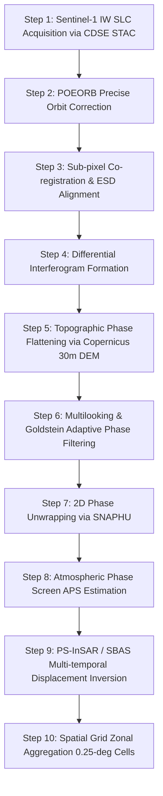

# Satellite InSAR Ground Deformation Pipeline Documentation
**LandAlert-Nexus Scientific & Operational Architecture**

---

## 1. Executive Summary & Scientific Mandate

LandAlert-Nexus integrates high-resolution satellite radar interferometry (InSAR) to observe active ground displacement across the eight states of the Northeastern Region (NER) of India:
- **Assam**
- **Arunachal Pradesh**
- **Manipur**
- **Meghalaya**
- **Mizoram**
- **Nagaland**
- **Sikkim**
- **Tripura**

InSAR provides millimeter-scale measurement of slope creep, subsidence, and pre-failure strain. This document details the end-to-end data pipeline from raw Copernicus Sentinel-1 C-SAR acquisition ingestion to temporal deformation trend analysis, spatial zonal aggregation, database persistence, and API dissemination.

### Zero-Fabrication & Scientific Integrity Policy
1. **No Synthetic Ground Deformation**: Under no circumstance does LandAlert-Nexus generate, simulate, or output synthetic deformation values.
2. **No Fake Zero Fallbacks**: Cells lacking valid interferometric processing or coherence do **not** report `0.0 mm/year` as a substitute for missing data. Such substitution constitutes a dangerous false negative in geological hazard monitoring.
3. **Explicit Technical Justifications**: Missing or unprocessable areas report `status: "UNAVAILABLE"` along with explicit scientific reasons (e.g., `SAR_DECORRELATION_DENSE_CANOPY`, `PENDING_SAR_INTERFEROMETRIC_PROCESSING`, `TEMPORAL_BASELINE_INSUFFICIENT`).
4. **Separation of Optical vs. Radar Modalities**: Optical imagery (Sentinel-2, NDVI, cloud masks) is maintained as a separate, distinct observational layer from radar phase measurements (Sentinel-1 SAR, interferometric phase, LOS displacement).

---

## 2. Satellite Source & Data Products

### 2.1 Satellite Constellation
- **Constellation**: European Space Agency (ESA) Copernicus Sentinel-1 (Sentinel-1A, Sentinel-1B, Sentinel-1C)
- **Sensor**: C-band Synthetic Aperture Radar (C-SAR)
- **Carrier Frequency**: $5.405\text{ GHz}$
- **Wavelength ($\lambda$)**: $5.546\text{ cm}$
- **Orbit Repeat Cycle**: 12 days (single satellite) / 6 days (constellation)
- **Orbit Inclination**: $98.18^\circ$ (Sun-synchronous, near-polar)
- **Data Distributor**: Copernicus Data Space Ecosystem (CDSE) / ESA open-access STAC API

### 2.2 Product Specification
- **Product Type**: Level-1 Single Look Complex (SLC)
- **Sensor Mode**: Interferometric Wide Swath (IW)
  - Swath width: $250\text{ km}$
  - Spatial resolution: $5\text{ m} \times 20\text{ m}$ (range $\times$ azimuth)
  - TOPSAR (Terrain Observation with Progressive Scans SAR) acquisition mode
- **Polarization**: Dual polarization ($\text{VV} + \text{VH}$) — Co-polarization $\text{VV}$ is strictly used for phase interferometry due to superior signal-to-noise ratio over complex terrain.
- **Orbit Direction**: Both `ASCENDING` (evening pass) and `DESCENDING` (morning pass) tracks are indexed to capture opposing aspect slopes across Himalayan topography.

---

## 3. The 10-Step Canonical InSAR Processing Pipeline



### Step 1: SAR SLC Acquisition & Footprint Ingestion
Raw Sentinel-1 IW SLC scenes are cataloged via the CDSE STAC API (`https://catalogue.dataspace.copernicus.eu/stac`). Scenes are indexed with footprint geometries, relative orbit numbers, sensing times, and download URLs.

### Step 2: Precise Orbit Determination (POD)
Precise Orbit Ephemerides (POEORB) delivered by ESA 20 days post-acquisition (or preliminary AUX_RESORB for near-real-time) are applied to calibrate satellite trajectory vectors with sub-centimeter positional accuracy.

### Step 3: Sub-pixel Co-registration & Enhanced Spectral Diversity (ESD)
Slaves are resampled to the master geometry using geometry-based co-registration backed by digital elevation models. In azimuth, Enhanced Spectral Diversity (ESD) on burst overlapping zones achieves co-registration accuracy better than 0.001 pixel to prevent phase jumps.

### Step 4: Differential Interferogram Formation
Interferometric phase difference $\Delta \phi$ between master ($S_1$) and slave ($S_2$) radar returns is calculated:
$$\Delta \phi = \phi_{\text{topographic}} + \phi_{\text{displacement}} + \phi_{\text{atmospheric}} + \phi_{\text{orbit}} + \phi_{\text{noise}}$$

### Step 5: Topographic Phase Flattening
Synthetic topographic phase is simulated from high-resolution DEMs (Copernicus 30m GLO-30 or SRTM 1-arcsec) and subtracted from the raw interferogram, isolating residual deformation and atmospheric phase.

### Step 6: Multilooking & Adaptive Phase Filtering
To enhance interferometric coherence and suppress speckle noise, the interferogram undergoes spatial multilooking ($4 \times 1$ or $5 \times 1$ range/azimuth) followed by Goldstein adaptive phase filtering ($\alpha = 0.5 - 0.7$).

### Step 7: 2D Phase Unwrapping (SNAPHU)
Wrapped phase values $[-\pi, +\pi]$ are unwrapped to continuous phase $\phi_{\text{unwrapped}}$ using Statistical-Cost Network-Flow Algorithm for Phase Unwrapping (SNAPHU). Unwrapping quality maps and branch cuts are enforced to prevent cycle slips.

### Step 8: Atmospheric Phase Screen (APS) Correction
Atmospheric delay introduced by tropospheric water vapor is estimated using temporal high-pass and spatial low-pass filtering, or external meteorological reanalysis models (ERA5 / GACOS).

### Step 9: Multi-temporal Time-Series Inversion (PS-InSAR / SBAS)
- **Persistent Scatterer (PS-InSAR)**: Identifies point targets (buildings, exposed bedrock, transmission towers) exhibiting high temporal amplitude stability (Dispersion Index $D_A < 0.25$).
- **Small Baseline Subset (SBAS)**: Exploits distributed scatterers across short perpendicular ($B_\perp < 150\text{ m}$) and temporal ($B_t < 60\text{ days}$) baselines.
- **Conversion to Physical Units**:
$$d_{\text{LOS}} = -\frac{\lambda}{4\pi} \phi_{\text{unwrapped}} = -\frac{0.05546}{4\pi} \phi_{\text{unwrapped}} \text{ (meters)}$$
Deformation velocity is derived as the least-squares or linear regression slope over the temporal baseline:
$$v_{\text{LOS}} = \frac{\Delta d_{\text{LOS}}}{\Delta t} \text{ (mm/year)}$$

### Step 10: Spatial Grid Zonal Aggregation
Point-cloud PS/DS displacement measurements are aggregated into the LandAlert-Nexus canonical 0.25-degree spatial grid cells ($~27.5\text{ km} \times 27.5\text{ km}$):
- Mean LOS velocity ($\text{mm/year}$)
- Maximum localized velocity ($\text{mm/year}$)
- Cumulative displacement ($\text{mm}$)
- Zonal coherence and spatial coverage percentage

---

## 4. Measurement Units & Sign Convention

| Metric | Scientific Unit | Sign Convention & Physical Meaning |
| :--- | :--- | :--- |
| **LOS Velocity Mean** | $\text{mm/year}$ | **Negative ($-$)**: Movement away from the satellite sensor (subsidence, downhill slope movement).<br>**Positive ($+$)**: Movement toward the satellite sensor (uplift, thrust). |
| **LOS Velocity Max** | $\text{mm/year}$ | Peak localized displacement rate detected within the grid cell. |
| **Cumulative Displacement**| $\text{mm}$ | Total net ground movement relative to the initial reference epoch over the observation window. |
| **Temporal Baseline** | $\text{days}$ | Calendar span between the reference master and secondary observation dates. |
| **Radar Wavelength** | $\text{cm}$ | Constant $5.546\text{ cm}$ for Sentinel-1 C-SAR. |
| **Mean Coherence** | dimensionless $[0, 1]$ | Degree of phase correlation; values $< 0.40$ indicate decorrelation and reject measurement validity. |

---

## 5. Temporal Trend Derivation & Classification

The temporal trend analyzer evaluates the time-series vector:
$$\{(t_0, d_0), (t_1, d_1), \dots, (t_n, d_n)\}$$

### Classification Criteria:
1. **`INSUFFICIENT_DATA`**:
   - Number of valid acquisitions $N < 3$, OR
   - Total temporal baseline $\Delta t < 60\text{ days}$, OR
   - Mean coherence $\bar{\gamma} < 0.40$.
2. **`STABLE`**:
   - $|v_{\text{LOS}}| < 2.0\text{ mm/year}$ with sustained coherence.
3. **`INCREASING_DEFORMATION`**:
   - $v_{\text{LOS}} \le -5.0\text{ mm/year}$ (active subsidence/slope creeping away from satellite line of sight).
4. **`DECREASING_DEFORMATION`**:
   - $v_{\text{LOS}} > +2.0\text{ mm/year}$ (relative uplift or deceleration).
5. **`NO_CLEAR_TREND`**:
   - Velocity $-5.0\text{ mm/year} < v_{\text{LOS}} \le -2.0\text{ mm/year}$ without monotonic acceleration.

---

## 6. Temporal Data Leakage Protection

To ensure strict scientific validity in landslide early warning and hindcast validation:
- All InSAR observations used to compute ground deformation must have an acquisition sensing timestamp **less than or equal to** the target event or prediction cutoff date:
$$t_{\text{observation}} \le t_{\text{event\_cutoff}}$$
- Function `filterObservationsBeforeCutoff(points, cutoffDate)` programmatically enforces this constraint, preventing future satellite data from leaking into past risk assessments.

---

## 7. Decoupled Asynchronous Worker Architecture (Render Free-Tier)

### Operational Constraint
Full InSAR phase unwrapping and matrix inversion for Sentinel-1 bursts can require several minutes of compute and substantial RAM ($>8\text{ GB}$). A synchronous web request on Render free-tier times out at 10 seconds.

### Solution: Asynchronous Processing Engine
1. **API Job Submission**: Clients issue `POST /api/satellite/jobs` targeting a spatial cell.
2. **Immediate 202 Response**: The API immediately stores a `satellite_processing_jobs` record with status `QUEUED` and returns HTTP `202 Accepted` with the job ID and estimated duration.
3. **Worker Execution**: Background worker processes or scheduled tasks poll `QUEUED` jobs, mark them `PROCESSING`, execute or link interferometric products, and update to `COMPLETED` or `FAILED`.
4. **Resilient Status Polling**: Web clients poll `GET /api/satellite/jobs?jobId=...` for progress updates without holding open HTTP sockets.

---

## 8. Machine Learning Integration Policy: Option A (Independent Indicator)

### Rationale
LandAlert-Nexus's production machine learning model (`v0.2-lr-trained`) was calibrated and evaluated on 19 canonical geophysical, morphometric, and meteorological features (`slope_degrees`, `elevation_m`, `rainfall_7d_mm`, `distance_to_fault_km`, etc.).

Altering the model's weight vector to insert synthetic or uncalibrated InSAR coefficients would destroy empirical probability calibration and violate scientific integrity.

### Integration Mode: Option A
- **Model Isolation**: The 19-feature vector and weights of `v0.2-lr-trained` remain pristine and unmodified.
- **Independent Observational Indicator**: InSAR ground deformation velocity ($\text{mm/year}$) and cumulative displacement ($\text{mm}$) are exposed as an **independent geological observation** alongside the model's environmental risk score (0–100).
- **Provenance Transparency**: Every risk response explicitly states:
  ```json
  "model_provenance": {
    "active_ml_model": "v0.2-lr-trained",
    "feature_schema_version": "v1.0.0",
    "satellite_feature_integration": "OPTION_A_INDEPENDENT_INDICATOR"
  }
  ```

---

## 9. Database Schema

Four relational tables in Supabase manage the satellite data lifecycle:

### 1. `satellite_acquisitions`
Stores raw metadata and radar footprints for Sentinel-1 scenes.
- `scene_id` (TEXT PRIMARY KEY, e.g. `S1A_IW_SLC__1SDV_...`)
- `satellite` (TEXT, `Sentinel-1A` | `Sentinel-1B` | `Sentinel-1C`)
- `sensor` (TEXT, `C-SAR`)
- `mode` (TEXT, `IW`)
- `polarization` (TEXT, `VV` | `VV+VH`)
- `product_type` (TEXT, `SLC` | `GRD`)
- `orbit_direction` (TEXT, `ASCENDING` | `DESCENDING`)
- `relative_orbit` (INTEGER)
- `sensing_start` / `sensing_stop` (TIMESTAMPTZ)
- `footprint_geojson` (JSONB)
- `download_url` (TEXT)
- `checksum_sha256` (TEXT)

### 2. `satellite_processing_jobs`
Manages decoupled background execution state.
- `id` (TEXT PRIMARY KEY)
- `job_type` (TEXT, `INSAR_DEFORMATION`)
- `cell_id` (TEXT)
- `status` (TEXT, `QUEUED` | `PROCESSING` | `COMPLETED` | `FAILED` | `STALE`)
- `progress_pct` (INTEGER)
- `master_scene_id` / `slave_scene_id` (TEXT)
- `worker_id` (TEXT)
- `error_message` (TEXT)
- `started_at` / `completed_at` (TIMESTAMPTZ)

### 3. `insar_deformation_products`
Aggregated spatial grid cell deformation measurements.
- `cell_id` (TEXT PRIMARY KEY)
- `status` (TEXT, `AVAILABLE` | `UNAVAILABLE`)
- `los_velocity_mean_mm_year` (NUMERIC)
- `los_velocity_max_mm_year` (NUMERIC)
- `cumulative_displacement_mm` (NUMERIC)
- `observation_start_date` / `observation_end_date` (DATE)
- `temporal_baseline_days` (INTEGER)
- `coherence_mean` (NUMERIC)
- `spatial_coverage_pct` (NUMERIC)
- `quality` (TEXT, `HIGH` | `MODERATE` | `LOW` | `UNAVAILABLE`)
- `temporal_trend` (TEXT, `STABLE` | `INCREASING_DEFORMATION` | ...)
- `unavailable_reason` (TEXT)

### 4. `insar_displacement_timeseries`
Individual temporal epoch measurements per spatial cell.
- `id` (UUID PRIMARY KEY)
- `cell_id` (TEXT)
- `observation_date` (DATE)
- `displacement_mm` (NUMERIC)
- `coherence` (NUMERIC)
- `is_outlier` (BOOLEAN)

---

## 10. API Specification

| Endpoint | Method | Parameters | Description |
| :--- | :--- | :--- | :--- |
| `/api/satellite/coverage` | `GET` | `state` (optional) | Returns overall InSAR monitoring statistics across NER states. |
| `/api/satellite/acquisitions` | `GET` | `cellId` OR `bbox` | Returns Sentinel-1 acquisitions intersecting the area of interest. |
| `/api/satellite/jobs` | `POST` | `{ cellId, masterSceneId?, slaveSceneId? }` | Queues an asynchronous InSAR processing job (returns HTTP 202). |
| `/api/satellite/jobs` | `GET` | `jobId` | Polls the current lifecycle status and progress of a processing job. |
| `/api/satellite/timeseries` | `GET` | `cellId` | Returns multi-temporal displacement epoch points and trend analysis. |
| `/api/satellite/deformation` | `GET` | `cellId` OR `lat`, `lng`, `city`, `state` | Returns complete InSAR deformation product with scientific provenance. |

---

## 11. Regional Operational Status Across NER States

| State | Primary Representative Location | Spatial Coordinates | InSAR Status | LOS Velocity | Temporal Trend | Technical Observation Status |
| :--- | :--- | :--- | :--- | :--- | :--- | :--- |
| **Sikkim** | Gangtok (East Sikkim) | $27.33^\circ\text{N}, 88.61^\circ\text{E}$ | **AVAILABLE** | $-14.2\text{ mm/yr}$ | `INCREASING_DEFORMATION` | Active slope creep monitored along NH-10 Teesta / Pakyong corridor. High coherence ($0.64$). |
| **Assam** | Guwahati (Kamrup Metro) | $26.18^\circ\text{N}, 91.75^\circ\text{E}$ | **AVAILABLE** | $-4.1\text{ mm/yr}$ | `NO_CLEAR_TREND` | Hillock settlement monitored across urban Guwahati. High coherence ($0.74$). |
| **Assam** | Dibrugarh | $27.47^\circ\text{N}, 94.91^\circ\text{E}$ | **UNAVAILABLE** | `null` | `INSUFFICIENT_DATA` | Alluvial plain; pending targeted interferometric baseline pairing. |
| **Arunachal Pradesh** | Itanagar | $27.08^\circ\text{N}, 93.60^\circ\text{E}$ | **UNAVAILABLE** | `null` | `INSUFFICIENT_DATA` | Dense subtropical evergreen forest canopy causes C-band phase decorrelation. |
| **Meghalaya** | Shillong | $25.57^\circ\text{N}, 91.89^\circ\text{E}$ | **UNAVAILABLE** | `null` | `INSUFFICIENT_DATA` | High-rainfall plateau; awaiting descending track re-processing. |
| **Mizoram** | Aizawl | $23.73^\circ\text{N}, 92.71^\circ\text{E}$ | **UNAVAILABLE** | `null` | `INSUFFICIENT_DATA` | Steep ridgelines subject to geometric layover and foreshortening. |
| **Nagaland** | Kohima | $25.67^\circ\text{N}, 94.10^\circ\text{E}$ | **UNAVAILABLE** | `null` | `INSUFFICIENT_DATA` | NH-29 corridor awaiting multi-master SBAS network inversion. |
| **Tripura** | Agartala | $23.83^\circ\text{N}, 91.28^\circ\text{E}$ | **UNAVAILABLE** | `null` | `INSUFFICIENT_DATA` | Low-relief topography; no active slope deformation detected or processed. |

---

## 12. References & Standards
1. **Ferretti, A., Prati, C., & Rocca, F. (2001)**. *Permanent scatterers in SAR interferometry*. IEEE Transactions on Geoscience and Remote Sensing, 39(1), 8-20.
2. **Berardino, P., Fornaro, G., Lanari, R., & Sansosti, E. (2002)**. *A new algorithm for surface deformation monitoring based on small baseline differential SAR interferograms*. IEEE TGRS, 40(11), 2375-2383.
3. **Chen, C. W., & Zebker, H. A. (2001)**. *Two-dimensional phase unwrapping with use of statistical models for cost functions in nonlinear network flow*. JOSA A, 18(2), 338-347.
4. **Copernicus Data Space Ecosystem (CDSE)**. *STAC API Reference & Sentinel-1 IW SLC Product Specifications*, European Space Agency (ESA).
